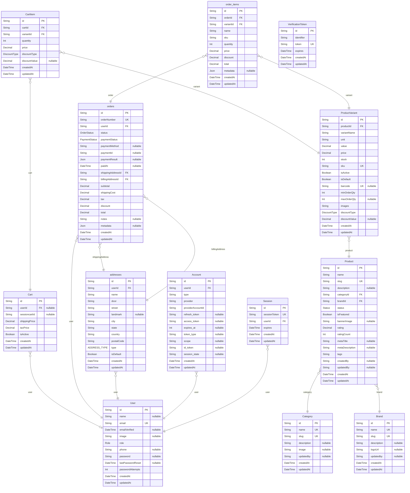

# SSB Store
> Generated by [`prisma-markdown`](https://github.com/samchon/prisma-markdown)

- [default](#default)

## default

### `Cart`

**Properties**
  - `id`: 
  - `userId`: 
  - `sessioncartId`: 
  - `shippingPrice`: 
  - `taxPrice`: 
  - `isActive`: 
  - `createdAt`: 
  - `updatedAt`: 

### `CartItem`

**Properties**
  - `id`: 
  - `cartId`: 
  - `variantId`: 
  - `quantity`: 
  - `price`: 
  - `discountType`: 
  - `discountValue`: 
  - `createdAt`: 
  - `updatedAt`: 

### `orders`

**Properties**
  - `id`: 
  - `orderNumber`: 
  - `userId`: 
  - `status`: 
  - `paymentStatus`: 
  - `paymentMethod`: 
  - `paymentId`: 
  - `paymentResult`: 
  - `paidAt`: 
  - `shippingAddressId`: 
  - `billingAddressId`: 
  - `subtotal`: 
  - `shippingCost`: 
  - `tax`: 
  - `discount`: 
  - `total`: 
  - `notes`: 
  - `metadata`: 
  - `createdAt`: 
  - `updatedAt`: 

### `order_items`

**Properties**
  - `id`: 
  - `orderId`: 
  - `variantId`: 
  - `name`: 
  - `sku`: 
  - `quantity`: 
  - `price`: 
  - `discount`: 
  - `total`: 
  - `metadata`: 
  - `createdAt`: 
  - `updatedAt`: 

### `Category`

**Properties**
  - `id`: 
  - `name`: 
  - `slug`: 
  - `description`: 
  - `image`: 
  - `updatedby`: 
  - `createdAt`: 
  - `updatedAt`: 

### `Brand`

**Properties**
  - `id`: 
  - `name`: 
  - `slug`: 
  - `description`: 
  - `logoUrl`: 
  - `updatedby`: 
  - `createdAt`: 
  - `updatedAt`: 

### `Product`

**Properties**
  - `id`: 
  - `name`: 
  - `slug`: 
  - `description`: 
  - `categoryId`: 
  - `brandId`: 
  - `status`: 
  - `isFeatured`: 
  - `bannerImage`: 
  - `rating`: 
  - `ratingCount`: 
  - `metaTitle`: 
  - `metaDescription`: 
  - `tags`: 
  - `createdBy`: 
  - `updatedBy`: 
  - `createdAt`: 
  - `updatedAt`: 

### `ProductVariant`

**Properties**
  - `id`: 
  - `productId`: 
  - `variantName`: 
  - `unit`: 
  - `value`: 
  - `price`: 
  - `stock`: 
  - `sku`: 
  - `isActive`: 
  - `isDefault`: 
  - `barcode`: 
  - `minOrderQty`: 
  - `maxOrderQty`: 
  - `images`: 
  - `discountType`: 
  - `discountValue`: 
  - `createdAt`: 
  - `updatedAt`: 

### `addresses`

**Properties**
  - `id`: 
  - `userId`: 
  - `name`: 
  - `door`: 
  - `street`: 
  - `landmark`: 
  - `city`: 
  - `state`: 
  - `country`: 
  - `postalCode`: 
  - `type`: 
  - `isDefault`: 
  - `createdAt`: 
  - `updatedAt`: 

### `User`

**Properties**
  - `id`: 
  - `name`: 
  - `email`: 
  - `emailVerified`: 
  - `image`: 
  - `role`: 
  - `phone`: 
  - `password`: 
  - `lastPasswordReset`: 
  - `passwordAttempts`: 
  - `createdAt`: 
  - `updatedAt`: 

### `Account`

**Properties**
  - `id`: 
  - `userId`: 
  - `type`: 
  - `provider`: 
  - `providerAccountId`: 
  - `refresh_token`: 
  - `access_token`: 
  - `expires_at`: 
  - `token_type`: 
  - `scope`: 
  - `id_token`: 
  - `session_state`: 
  - `createdAt`: 
  - `updatedAt`: 

### `Session`

**Properties**
  - `id`: 
  - `sessionToken`: 
  - `userId`: 
  - `expires`: 
  - `createdAt`: 
  - `updatedAt`: 

### `VerificationToken`

**Properties**
  - `id`: 
  - `identifier`: 
  - `token`: 
  - `expires`: 
  - `createdAt`: 
  - `updatedAt`: 